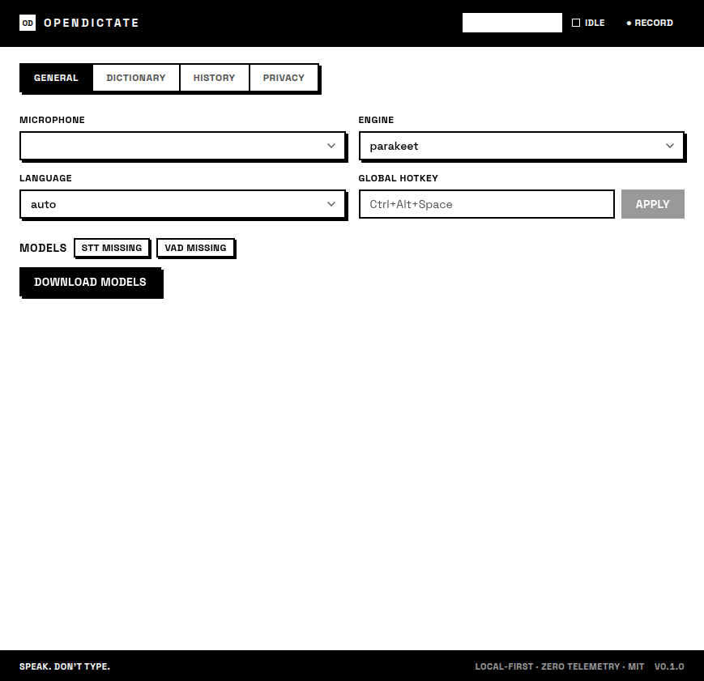
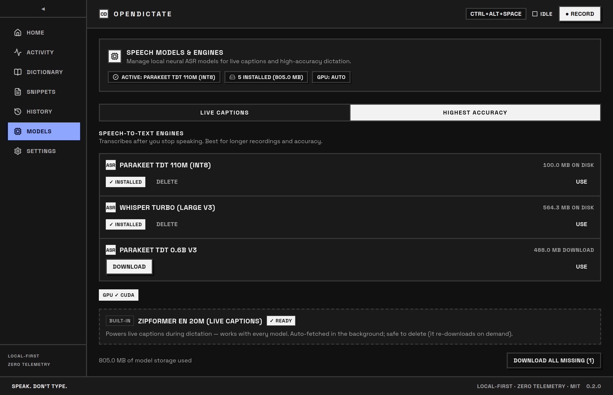
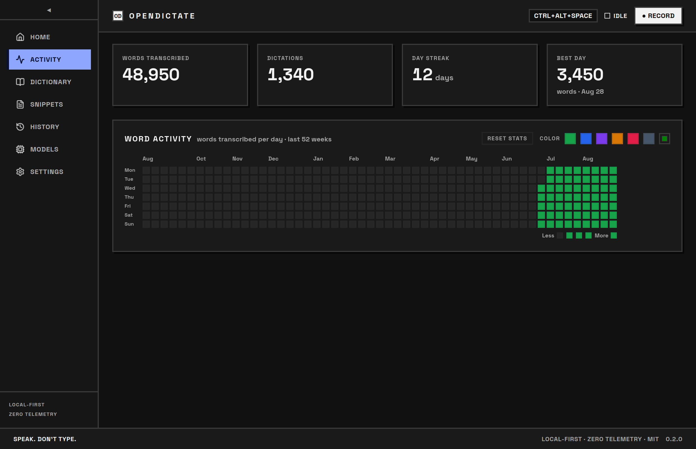
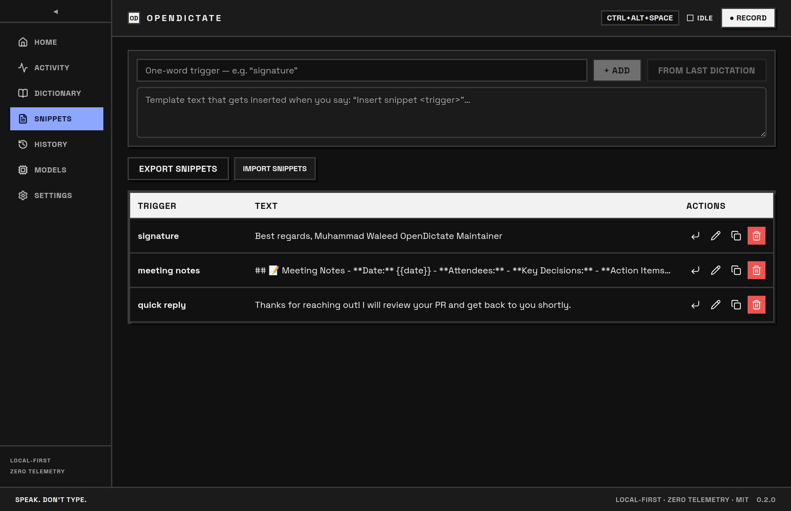
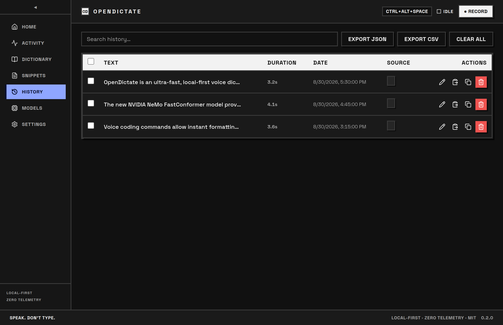

<p align="center">
  <h1 align="center">OpenDictate</h1>
  <p align="center"><strong>Free, open-source, local-first AI voice dictation for your desktop.</strong></p>
  <p align="center">Press a hotkey, speak naturally, and your words are instantly typed into whatever app has focus — with zero cloud, zero telemetry, and zero subscription fees.</p>
</p>

<p align="center">
  <a href="https://github.com/Muhammad-Waleed381/OpenDictate/releases"></a>
  
  <a href="LICENSE"></a>
  <a href="https://tauri.app"></a>
  
  <a href="https://github.com/Muhammad-Waleed381/OpenDictate/stargazers"></a>
</p>

<p align="center">
  <a href="https://opendictate.vercel.app"><strong>🌐 Website</strong></a> &nbsp;•&nbsp;
  <a href="https://opendictate.vercel.app/docs"><strong>📖 Tutorial & User Guide</strong></a> &nbsp;•&nbsp;
  <a href="https://github.com/Muhammad-Waleed381/OpenDictate/releases"><strong>⚡ Releases</strong></a>
</p>

<p align="center">
  
</p>

---

## ⚡ Instant Downloads (v0.2.0)

Get the latest installer for your operating system directly from [Releases](https://github.com/Muhammad-Waleed381/OpenDictate/releases/latest):

| 🪟 Windows (Experimental) | 🍎 macOS | 🐧 Linux |
| :---: | :---: | :---: |
| [**Download Setup (.exe)**](https://github.com/Muhammad-Waleed381/OpenDictate/releases/latest) / [.msi](https://github.com/Muhammad-Waleed381/OpenDictate/releases/latest) | [**Download DMG (.dmg)**](https://github.com/Muhammad-Waleed381/OpenDictate/releases/latest) | [**Download AppImage**](https://github.com/Muhammad-Waleed381/OpenDictate/releases/latest) / [.deb](https://github.com/Muhammad-Waleed381/OpenDictate/releases/latest) |
| *Windows 10 / 11 (x64)* | *Universal (Apple Silicon & Intel)* | *Ubuntu / Debian / Fedora / Arch* |

---

## 🥊 Why OpenDictate? (Comparison with Alternatives)

Cloud dictation tools require sending raw audio across the internet, paying recurring monthly fees, and suffer from network latency. OpenDictate runs state-of-the-art speech models **100% locally on your hardware** — after a one-time model download, voice typing is instantaneous, completely private, and free forever.

| Feature | **OpenDictate** | **Wispr Flow** | **Superwhisper** | **Apple / Windows Dictation** |
| :--- | :---: | :---: | :---: | :---: |
| **Pricing** | **100% Free & Open Source (MIT)** | \$12 – \$20 / month | \$8 / month or \$199 | Built-in |
| **Privacy & Cloud** | **100% Local (Zero Cloud Required)** | Cloud API dependency | Local (Mac only) | Cloud / Telemetry |
| **Platform Support** | **Linux, macOS, Windows (Exp)** | Mac & Windows | macOS only | Single OS |
| **AI Speech Models** | **Whisper, FastConformer 80ms, Parakeet** | Proprietary Cloud | Whisper | Proprietary |
| **Voice Actions / Coding** | **Yes** (Casing, navigation, undo, edit) | Partial | Partial | Basic |
| **Latency** | **~80ms** (FastConformer Streaming) | ~500ms+ (Network lag) | ~300ms | ~400ms |
| **Custom Dictionary** | **Yes** (Hotword boosting) | Yes | Yes | Limited |
| **Telemetry / Tracking** | **Zero Telemetry** | Analytics tracked | Basic analytics | OS telemetry |

---

## ✨ Features

- 🎙️ **One Hotkey, Anywhere** — Global shortcut (<kbd>Ctrl</kbd>+<kbd>Alt</kbd>+<kbd>Space</kbd> on Windows/Linux, <kbd>⌘</kbd>+<kbd>⇧</kbd>+<kbd>Space</kbd> on macOS) triggers dictation; the recognized text is injected into whichever text field or application currently has focus.
- 🏎️ **Ultra-Low Latency Streaming (80ms)** — Real-time live transcription powered by the NVIDIA FastConformer CTC engine.
- 🎮 **Voice Actions & Voice Coding** — Control your text hands-free with voice commands:
  - *Formatting*: Say `"all caps <text>"`, `"camel case <text>"`, `"snake case <text>"`, `"title case <text>"`.
  - *Editing*: Say `"scratch that"` (Undo), `"delete word"`, `"delete line"`, `"clear all"`.
  - *Structure*: Say `"new line"`, `"new paragraph"`, `"tab"`, `"bullet point"`.
  - *Workflow*: Say `"prompt and send <query>"`, `"submit"`, `"interrupt"`, `"switch to <app>"`, `"open <url>"`.
- 🎛️ **Dedicated Models Hub** — 1-click model download and management with real-time disk storage metrics and hardware accelerator indicators (`CPU`, `CUDA`, `CoreML`).
- ⚡ **Live Floating Dock & Real-Time Captions** — Minimal floating pill dock showing audio waveform meter, recording status, and real-time live captions while you speak.
- 📖 **Custom Vocabulary & Hotwords** — Add company names, technical jargon, code symbols, and acronyms to the built-in dictionary for boosted recognition accuracy.
- ✂️ **Snippet Expansion** — Expand boilerplate text templates on the fly by saying `"insert snippet <trigger>"`.
- 🪄 **Optional AI Voice Polish** — Clean up disfluencies, remove filler words ("um", "ah"), or auto-format raw thoughts into bullet points using local SLMs or cloud LLMs (Groq).
- 📅 **History & Yearly Heatmap** — Full searchable history stored in a local SQLite database with GitHub-style annual activity heatmap.
- 🔒 **100% Private & Offline** — No accounts, no subscriptions, no telemetry, and zero network calls after model downloads.

---

## 📚 Tutorials & Documentation

Looking for step-by-step setup guides, voice coding cheat sheets, or troubleshooting tips?

👉 **[Read the Full Documentation & Tutorial at opendictate.vercel.app/docs](https://opendictate.vercel.app/docs)**

- 🚀 **[Quickstart Guide](https://opendictate.vercel.app/docs#quickstart)** — 0 to Voice in 60 seconds on Linux, macOS, and Windows.
- 🎮 **[Voice Commands Reference](https://opendictate.vercel.app/docs#voice-commands)** — Complete list of casing modifiers, editing keys, and navigation macros.
- 🤖 **[Hardware Acceleration](https://opendictate.vercel.app/docs#models)** — Choosing between FastConformer (80ms), Parakeet TDT, and Whisper.
- ❓ **[Troubleshooting & FAQs](https://opendictate.vercel.app/docs#troubleshooting)** — Linux `/dev/uinput` configuration and macOS permissions.

---

## 📸 App Showcase

| **Local Neural Models Hub** | **Productivity & Words Heatmap** |
| :---: | :---: |
|  |  |
| *Manage local Whisper & Parakeet models with CUDA GPU acceleration* | *Track your typing speed, streak days, and yearly activity* |

| **Voice Snippets & Templates** | **Searchable Dictation History** |
| :---: | :---: |
|  |  |
| *Expand multi-line boilerplates instantly by voice trigger* | *Local SQLite database of all transcribed utterances* |

---

## 💻 Platform Support

| Platform | Status | Input Injection | Autostart Support | Package Types |
| :--- | :---: | :--- | :--- | :--- |
| **Linux** | ✅ Supported | Persistent `/dev/uinput` device | XDG Autostart (`.desktop`) | `.AppImage`, `.deb`, `.rpm` |
| **macOS** | ✅ Supported | `CGEvent` & Native Modifiers | LaunchAgent Plist | Universal `.dmg` (Apple Silicon & Intel) |
| **Windows** | 🧪 Experimental | `SendInput` API (Enigo) | Windows Registry (`Run`) | `.exe` (NSIS), `.msi` |

---

## 🤖 Speech-to-Text Model Catalog

OpenDictate supports a wide variety of state-of-the-art open speech models to match your hardware:

### Offline Accuracy Models
| Model | Size | Best For |
| :--- | :---: | :--- |
| **Parakeet TDT 110M (int8)** | ~104 MB | **Default.** Ultra-fast, highly accurate English on modest CPUs. |
| **Parakeet TDT 0.6B v3** | ~487 MB | Highest single-pass accuracy; multilingual support. |
| **Parakeet Unified EN 0.6B** | ~501 MB | Unified punctuation and casing out of the box. |
| **Whisper Tiny (en)** | ~118 MB | Ultra-lightweight Whisper model for low RAM systems. |
| **Whisper Base (en)** | ~209 MB | Balanced Whisper model for standard desktop use. |
| **Whisper Small (en)** | ~636 MB | High accuracy Whisper model. |
| **Whisper Turbo (Large v3)** | ~564 MB | Highest-speed Large v3 Whisper model. |
| **Whisper Medium (en)** | ~1.9 GB | Maximum Whisper accuracy for high-spec workstations. |

### Streaming & Real-Time Models
| Model | Size | Latency | Purpose |
| :--- | :---: | :---: | :--- |
| **FastConformer CTC (Streaming)** | ~110 MB | **80ms** | Ultra-low latency streaming recognition. |
| **Parakeet Unified 0.6B Streaming** | ~501 MB | ~160ms | High-accuracy streaming transcription. |
| **Zipformer EN 20M** | ~29 MB | Real-time | Internal live caption engine. |
| **Silero VAD v4** | ~1.7 MB | Real-time | Intelligent voice activity and silence detection. |

---

## 🏗️ Architecture & How It Works

```
Microphone ──► Audio Capture (cpal / PulseAudio) ──► Shared Ring Buffer
                                                        │
         ┌──────────────────────────────────────────────┼────────────────────────────────────────┐
         ▼                                              ▼                                        ▼
   Live Captions                                Silence Detection                        Audio Level Meter
(Zipformer 20M Streaming)                    (Silero VAD v4 / Energy)                       (Floating Dock)
                                                        │
                                                        ▼
                                           Accuracy Speech Recognition
                                       (Whisper / FastConformer / Parakeet)
                                                        │
                                                        ▼
                                            Text Normalization & Rules
                                        (Punctuation / Dictionary Hotwords)
                                                        │
                                                        ▼
                                           Optional AI Polish / Snippet
                                                        │
                                                        ▼
                                            Synthetic Input Injection
                                          (uinput / SendInput / CGEvent)
```

---

## 🛠️ Building From Source

### Prerequisites
- **Node.js 20+** and **npm**
- **Rust stable** (with Cargo)
- **CMake** and C++ compiler (for native `sherpa-onnx` bindings)

### Development Setup

```bash
# 1. Clone repository
git clone https://github.com/Muhammad-Waleed381/OpenDictate.git
cd OpenDictate

# 2. Install dependencies
npm install

# 3. Run in development mode
npm run tauri dev

# 4. Build release binaries
npm run tauri build
```

#### Linux System Dependencies (Ubuntu / Debian)
```bash
sudo apt update
sudo apt install -y libwebkit2gtk-4.1-dev libappindicator3-dev librsvg2-dev \
                    patchelf libasound2-dev libpulse-dev libudev-dev libgtk-3-dev cmake build-essential
```

---

## 🔒 Privacy Guarantee

OpenDictate is built on strict local-first principles:
- **Zero Audio Transmission**: Your voice is processed directly on your CPU/GPU and never leaves your device.
- **Zero Telemetry / Analytics**: No tracking pixels, analytics beacons, or remote logging.
- **Local Storage**: Dictionary words, snippets, and dictation history are kept in a local SQLite file in your user data directory.

---

## 📜 License & Disclaimers

This project is licensed under the [MIT License](LICENSE) © Muhammad Waleed.

> *All product names, logos, and brands mentioned (such as Wispr Flow, Superwhisper, Apple Dictation, Windows Speech Recognition) are property of their respective owners. All company, product, and service names used in this document are for identification and comparative purposes only. Use of these names does not imply any endorsement or affiliation.*
